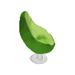
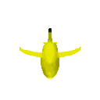
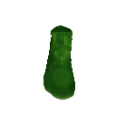
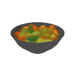

# Shap-E

This is the official code and model release for [Shap-E: Generating Conditional 3D Implicit Functions](https://arxiv.org/abs/2305.02463).

 * See [Usage](#usage) for guidance on how to use this repository.
 * See [Samples](#samples) for examples of what our text-conditional model can generate.

# Samples

Here are some highlighted samples from our text-conditional model. For random samples on selected prompts, see [samples.md](samples.md).

<table>
    <tbody>
        <tr>
            <td align="center">
                
            </td>
            <td align="center">
                
            </td align="center">
            <td align="center">
                
            </td>
        </tr>
        <tr>
            <td align="center">A chair that looks like an avocado</td>
            <td align="center">An airplane that looks like a banana</td>
            <td align="center">A spaceship</td>
        </tr>
        <tr>
            <td align="center">
                
            </td>
            <td align="center">
                
            </td>
            <td align="center">
                
            </td>
        </tr>
        <tr>
            <td align="center">A birthday cupcake</td>
            <td align="center">A chair that looks like a tree</td>
            <td align="center">A green boot</td>
        </tr>
        <tr>
            <td align="center">
                
            </td>
            <td align="center">
                
            </td>
            <td align="center">
                
            </td>
        </tr>
        <tr>
            <td align="center">A penguin</td>
            <td align="center">Ube ice cream cone</td>
            <td align="center">A bowl of vegetables</td>
        </tr>
    </tbody>
<table>

# Usage

Install with `pip install -e .`.

To get started with examples, see the following notebooks:

* [sample_text_to_3d.ipynb](shap_e/examples/sample_text_to_3d.ipynb) - sample a 3D model, conditioned on a text prompt.
* [sample_image_to_3d.ipynb](shap_e/examples/sample_image_to_3d.ipynb) - sample a 3D model, conditioned on a synthetic view image. To get the best result, you should remove background from the input image.
* [encode_model.ipynb](shap_e/examples/encode_model.ipynb) - loads a 3D model or a trimesh, creates a batch of multiview renders and a point cloud, encodes them into a latent, and renders it back. For this to work, install Blender version 3.3.1 or higher, and set the environment variable `BLENDER_PATH` to the path of the Blender executable.
